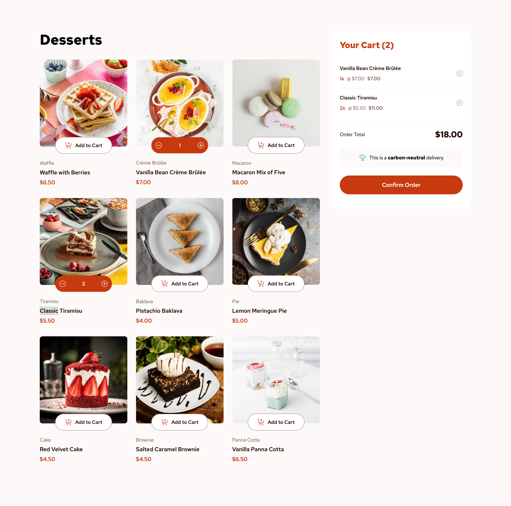

# Frontend Mentor - Product list with cart solution

This is a solution to the [Product list with cart challenge on Frontend Mentor](https://www.frontendmentor.io/challenges/product-list-with-cart-5MmqLVAp_d). Frontend Mentor challenges help you improve your coding skills by building realistic projects.

## Table of contents

- [Overview](#overview)
  - [The challenge](#the-challenge)
  - [Screenshot](#screenshot)
  - [Links](#links)
- [My process](#my-process)
  - [Built with](#built-with)
  - [What I learned](#what-i-learned)
  - [Continued development](#continued-development)
- [Author](#author)

## Overview

### The challenge

Users should be able to:

- Add items to the cart and remove them
- Increase/decrease the number of items in the cart
- See an order confirmation modal when they click "Confirm Order"
- Reset their selections when they click "Start New Order"
- View the optimal layout for the interface depending on their device's screen size
- See hover and focus states for all interactive elements on the page

### Screenshot



### Links

- Solution URL: [Github](https://github.com/delroscol98/Product-Cart)

<!--
NOTE: To view the live site, download the file and run the following commands in the command line:
1. npm install
2. npm run server
3. npm run dev
 -->

## My process

### Built with

- Semantic HTML5 markup
- CSS custom properties
- Flexbox
- CSS Grid
- Mobile-first workflow
- [React](https://reactjs.org/) - JS library

### What I learned

Walking into this project I knew it was going to be difficult, despite the functionality and the user experience seeming very simple, I knew that I was dealing with data fetching and more complex state management. Therefore the following mental notes were made:

1. The dessert list is only rendered and not used anywhere else, and therefore needs to be fetched and stored in some useState variable
2. The cart list is a bit more complex and needs to be updated depending on user interactions, plus it needs to be display when the user confirms their order, this calls for useContext
3. Due to mulitple state updates happening at a click of a button, useReducer is a necessity
4. Since I was fetching data, useEffect was needed coupled with useCallback to avoid infinite re-renders

Below is the CartContext used to store and organise state and handler functions

```js
import { useReducer } from "react";
import { useContext } from "react";
import { createContext } from "react";

const CartContext = createContext();

const initialState = {
  cart: [],
  showModal: false,
};

const reducer = (state, action) => {
  switch (action.type) {
    case "addDessert": {
      const existingCartItemIndex = state.cart.findIndex(
        (cartItem) => cartItem.name === action.payload.name
      );
      const existingCartItem = state.cart[existingCartItemIndex];

      if (existingCartItem) {
        const updatedItem = {
          ...existingCartItem,
          count: existingCartItem.count + 1,
        };
        const updatedItems = [...state.cart];
        updatedItems[existingCartItemIndex] = updatedItem;
        return { ...state, cart: updatedItems };
      } else {
        return {
          ...state,
          cart: [...state.cart, { ...action.payload, count: 1 }],
        };
      }
    }
    case "minusDessert": {
      const existingCartItemIndex = state.cart.findIndex(
        (cartItem) => cartItem.name === action.payload.name
      );
      const existingCartItem = state.cart[existingCartItemIndex];

      if (existingCartItem.count > 0) {
        const updatedItem = {
          ...action.payload,
          count: existingCartItem.count--,
        };
        let updatedItems = [...state.cart];
        updatedItems[existingCartItemIndex] = updatedItem;
        return {
          ...state,
          cart: updatedItems,
        };
      } else {
        return {
          ...state,
          cart: state.cart.filter(
            (cartItem) => cartItem.name !== action.payload.name
          ),
        };
      }
    }
    case "deleteDessert":
      return {
        ...state,
        cart: state.cart.filter(
          (cartItem) => cartItem.name !== action.payload.name
        ),
      };
    case "confirmOrder":
      return {
        ...state,
        showModal: true,
      };
    case "newOrder":
      return {
        ...state,
        cart: [],
        showModal: false,
      };
    default:
      throw new Error("Action not recognised");
  }
};

function CartProvider({ children }) {
  const [{ cart, showModal }, dispatch] = useReducer(reducer, initialState);

  const handleAddDessertToCart = (dessert) => {
    dispatch({ type: "addDessert", payload: dessert });
  };

  const handleMinusDessertFromCart = (dessert) => {
    dispatch({ type: "minusDessert", payload: dessert });
  };

  const handleDeleteDessertFromCart = (dessert) => {
    dispatch({ type: "deleteDessert", payload: dessert });
  };

  const handleConfirmOrder = () => {
    dispatch({ type: "confirmOrder" });
  };

  const handleNewOrder = () => {
    dispatch({ type: "newOrder" });
  };

  return (
    <CartContext.Provider
      value={{
        cart,
        showModal,
        handleAddDessertToCart,
        handleMinusDessertFromCart,
        handleDeleteDessertFromCart,
        handleConfirmOrder,
        handleNewOrder,
      }}
    >
      {children}
    </CartContext.Provider>
  );
}

function useCart() {
  const context = useContext(CartContext);
  if (context === undefined)
    throw new Error("CartContext was used outside of CartProvider");
  return context;
}

export { CartProvider, useCart };
```

### Continued development

For future projects I would like to continue working with useContext and useReducer as my projects more and more complex in order to keep my state clear and organised.

## Author

- Frontend Mentor - [@delroscol98](https://www.frontendmentor.io/profile/delroscol98)
